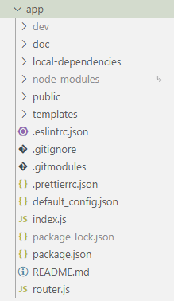
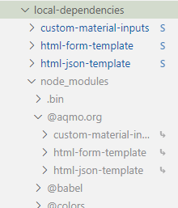

# Rudi console<!-- omit in toc -->

Ce projet est la "console" de Rudi. Il en gère les formulaires et la publication des résultat. 

Développeur :

- Florian Desmortreux

## Table des matières

- [Table des matières](#table-des-matières)
- [Pour développer](#pour-développer)
  - [Git clone](#git-clone)
  - [Introduction aux idée principale du projet](#introduction-aux-idée-principale-du-projet)
  - [Vue globale du projet](#vue-globale-du-projet)
    - [`local-dependencies`](#local-dependencies)
    - [`public`](#public)
    - [`template`](#template)
    - [`index.js`](#indexjs)
    - [`router.js`](#routerjs)
  - [Avant de développer](#avant-de-développer)
    - [Le dossier dev](#le-dossier-dev)
    - [Installer les dépendances](#installer-les-dépendances)
  - [Lancer le dev](#lancer-le-dev)
  - [Le développement des sous-modules](#le-développement-des-sous-modules)
- [La config](#la-config)
  - [`port`](#port)
  - [`host`](#host)
  - [`LOCAL`](#local)
  - [`API`](#api)
  - [`MEDIA.POST`](#mediapost)
  - [`MEDIA.connector`](#mediaconnector)
- [Front-end](#front-end)
  - [`Rudi.js`](#rudijs)
  - [`LexicalRessources.son`](#lexicalressourcesson)
  - [`Http.js`](#httpjs)
  - [`esm-module-shim.js`](#esm-module-shimjs)
  - [`RudiCrypto.js`](#rudicryptojs)
  - [`OverlayManager.js`](#overlaymanagerjs)
  - [`utils.js`](#utilsjs)
- [Log de prod](#log-de-prod)

## Pour développer

### Git clone

Dans le cas ou vous souhaiteriez aussi développer les dépendances `@aqmo.org/...`, il faudra installer les sous-modules git attaché à ce projet. N'oubliez pas d'utiliser le paramètre `--recurse-submodules` pour récupérer les submodules.

### Introduction aux idée principale du projet

Les principes de base du projet :

- Un serveur nodejs (express) qui sert des page web contenant des formulaires
- Back-end minimaliste : Le serveur sert juste à servir les ressources
- Front-end uniquement : tous le code qui permet de gérer les formulaire et la logique est front-end
- Les dépendances front-end sont installé avec `npm install` puis servis par le serveur (pas de CDN)

Les formulaire :

- Sont généré à partir des template dans le dossier `template` à la racine
- Sont généré à l'aide de la dépendance `html-form-template`

### Vue globale du projet



#### `local-dependencies`

Contient les sous modules du projet qui sont également des dépendences de celui-ci. Ces dépendances sont "html-json-template", "html-form-template" et "custom-material-inputs". Si vous ne faite que changer la console vous n'avez pas besoin de vous préocuper de ce dossier. En revanche, si vous développez aussi ces dépendances en parallèle de la "console" c'est un élément essentiel. (Voir [Installer les dépendances](#installer-les-dépendances))

#### `public`

Ce dossier est contient les ressources statiques qui sont servis au client par le serveur

#### `template`

Ce dossier contient les templates des formulaires

#### `index.js`

Le point d'entré de la "console" coté back-end. C'est le fichier qui lance le serveur

#### `router.js`

Contient le code qui gère le routage sur le serveur. C'est ici que sont définis les routes des formulaires et des dépendances qui sont servies au front-end.

### Avant de développer

#### Le dossier dev

Tout d'abord pour commencer à developper il faut créer un dossier `dev` à la racine du projet. Ce dossier est dans le .gitignore et c'est normal, chacun doit avoir le sien et contient des informations sensibles. Ensuite créez un fichier `dev/config.json` :

```json
{
  "LOGIN": "https://admin-rudi.aqmo.org/prodmanager-shared/api/v1/login",
  "MEDIA": {
    "POST": "https://data-rudi.aqmo.org/media/post",
    "connector": "https://data-rudi.aqmo.org/media/download",
    "key": "Basic conVkaXByb2Q6c3lzYWRtaW5pc2dyZWF0IQ=="
  }
}
```

et un fichier `dev/credentials.json` à completer :

```json
{
  "prodmanager": { "username": "...", "password": "..." }
}
```

Le premier est la config qui sera utilisé en mode dev (voir ci-dessous pour lancer le mode dev). Il définis une url à laquelle faire une requête pour avoir un token de connexion à la console et un token de connexion au serveru MEDIA. On reprécise toute la propriété "MEDIA" car elle écrasera celle de la config de base. NE PAS COMMIT CE FICHIER

Le second contient les informations de connexion pour récupérer un token de connexion au prod-manager quand on lance la "console" en local (aussi le mode dev). NE PAS COMMIT CE FICHIER

#### Installer les dépendances

Tout d'abord, il faut configurer votre npm pour lui indiquer que les dépendances du scope `aqmo.org` se situe sur le gitlab. Suivez le [tutoriel](https://gitlab.aqmo.org/public-rudi/public-packages) sur la page du gitlab pour créer votre token et configurer npm.

Vous devriez être capable de voir la config de votre npm en faisant `npm config list`. Vérifier que les ligne suivante y apparaissent :

```
@aqmo.org:registry = "https://repository.aqmo.org/npm/"
//repository.aqmo.org/npm/:_authToken = (protected)
```

Ensuite vous pourrez installer les dépendances npm.

> ⚠ Attention : La manip est pas la même si vous développer aussi les dépendances `@aqmo.org/...` (sous-modules du projet git).

Si vous souhaitez juste modifier la "console" faite juste :

```
npm install
npm install --dev
```

Si vous souhaitez aussi avoir la main sur les dépendances `@aqmo.org/...` qui sont dans les sous-modules, n'installez sourtout pas les dépendances du fichier `package.json` à la racine du projet. En effet, si on regarde ce fichier on voit :

```
"dependencies": {
    "@aqmo.org/custom-material-inputs": "^1.0.7",
    "@aqmo.org/html-form-template": "^1.0.4",
    "@aqmo.org/html-json-template": "^1.0.1",
    ...
```

Ici on voit bien que les dépendances `@aqmo.org/...` sont installé depuis le registre du gitlab. C'est une bonne choses car c'est le comportement souhaité en production. Au contraire, on ne veut pas avoir à publier une nouvelle version du module sur le registre et la ré-installer à chaque modification de ces dépendances. Pour pouvoir avoir les changements locaux des sous-modules lors du developpement on utilise une autre méthode.

Rendez vous dans le dossier `local-dependencies` qui se situe à la racine du projet. Ici vous trouverez le fichier `local-dependencies/package.json` qui contient les dépendances suivantes :

```
"dependencies": {
    "@aqmo.org/custom-material-inputs": "file:./custom-material-inputs",
    "@aqmo.org/html-form-template": "file:./html-form-template",
    "@aqmo.org/html-json-template": "file:./html-json-template",
```

Après avoir ouvert un terminal dans ce dossier, lancez `npm install` et `npm install --dev` de sorte à installer les dépendances à partir de `local-dependencies/package.json`. Vous devriez alors obtenir un dossier `local-dependencies/node_modules`.

Si vous observez le contenu de ce dossier, vous observerez un dossier "@aqmo.org" et dedans trois liens symboliques vers les sous-modules qui se trouves dans `local-dependencies`



La dernière étape consiste à retourner à la racine du projet et de créer un lien symbolique vers `local-dependencies/node_modules` avec la commande `ln -s` par exemple.

De cette manière notre projet utilise les dépendances définies dans `local-dependencies/package.json` lors du dévelopement en local. Les changement dans les sous modules apparaitrons alors, lors du developpement de la console.

### Lancer le dev

Un fois que vous avez compléter [l'étape précédente](#avant-de-développer), lancer le dev avec :

```
npm run dev
```

C'est l'équivalent de

```
nodemon index.js -- --config ./dev/config.json --dev
```

### Le développement des sous-modules

L'environnement de test est lié à la branch master et utilise les sous-modules comme dépendances. Pour voir les changement des sous-modules dans l'environnement de test il suffit de pousser les changement des sous-modules et bien penser que les changement de ces sous-modules sont aussi à commiter dans la "console".

Si vous modifier les sous modules et souhaiter publier les modifications suivez les instruction suivantes.

1. Ouvrez un terminal dans le sous-module et commitez vos changement.
2. Modifiez le numéro de version dans le `package.json` de votre sous module. Ensuite, c
3. Commitez de nouveau avec le nom de votre version. Exemple : `git commit -m "v1.0.0"`
4. Tagger le commit avec le numéro de version. Exemple : `git tag v1.0.0`
5. Pushez les modification et le tag. Exemple : `git push origin master v1.0.0`
6. Utilisez npm pour publier la nouvelle version au registre. `npm pack` puis `npm publish`. Cela requiert que vous ayez correctement configurer npm pour publier sur le gitlab (voir [Installer les dépendances](#installer-les-dépendances))
7. Revennez dans le dossier de la "console". Dans le `package.json` à la racine changer le numéro de version de votre dépendance.
8. Utilisez git pour commit et push la modif
9. En production rendez vous sur les [liens de log](#log-de-prod) et relancez l'environnement édité

Si vous avez réussit toutes ces étapes les changements devrait tourner en production

## La config

La "console" définie une config par défaut dans le fichier `default_config.json`

```json
{
  "port": 3038,
  "host": "localhost",
  "LOCAL": "",
  "API": "https://admin-rudi.aqmo.org/prodmanager-shared/api/admin",
  "MEDIA": {
    "POST": "https://data-rudi.aqmo.org/media/post",
    "connector": "https://data-rudi.aqmo.org/media/download"
  }
}
```

> ⚠ Attention : Pas de "/" à la fin des adresses

### `port`

Le port sur lequel le serveur doit écouter

### `host`

L'adresse ip sur laquel le serveur doit écouter

### `LOCAL`

Le chemin à partir de la racine du nom de domaine (ou adresse ip) à partir du quel le serveur est attaché. Ce paramètre est utilisé pour fetch les ressources dans le front-end.

### `API`

L'url de l'API Rudi sur laquel publier les résutlats

### `MEDIA.POST`

L'url sur laquel sont publié les fichiers des formulaires

### `MEDIA.connector`

L'url sur laquel les fichiers publié seront accessible. On ajoutera le media_id à cette url

## Front-end

Les principes :

- Il y a une page html par formulaire
- Une page html est liée à un fichier js qui gère le formulaire
- Tous les formulaires dépendent de `Rudi.js` qui est une sorte de wrapper au dessus `html-form-template`

### `Rudi.js`

Regroupe le code commun à tous les formulaires. Il est pensé comme une machine à état qui permet de déterminer les messages d'erreur à afficher à l'utilisateur si il y a une erreur. Il définis aussi un composant custom par dessus `custom-material-inputs` et `html-form-template`. Il est utilisé par le champs `service` des métadonnées.

### `LexicalRessources.son`

Ressources lexicales des formulaires. Utilisé par `Rudi.js`

### `Http.js`

Définis une méthode plus simple que les XMLHttpRequest pour les requêtes http

### `esm-module-shim.js`

Un polyfill ([Github](https://github.com/guybedford/es-module-shims)) pour les [import map](https://github.com/guybedford/es-module-shims). Permet de redéfinir les routes des import dans le front-end. Par exemple, `Rudi.js` importe `html-form-template` avec la ligne suivante

```js
import '@aqmo.org/html-form-template';
```

Ce qui est impossible dans le front-end normalement car `@aqmo.org/html-form-template` n'est pas une route valide. Cepandant grâce aux import map on peut définir dans les pages html, la balise suivante :

```html
<script type="importmap">
  {
    "imports": {
      "@aqmo.org/custom-material-inputs": "./dependencies/custom-material-inputs",
      "@aqmo.org/html-form-template": "./dependencies/html-form-template",
      "@aqmo.org/html-json-template": "./dependencies/html-json-template"
    }
  }
</script>
```

Et ceci permet au moteur javascript de comprendre les import qu'il ne comprendrais pas autrement. Le rôle de `esm-module-shim.js` est de rendre cette fonctionnalité disponible dans tous les navigateurs. Par exemple, au moment on sont écrit ces ligne, les import map sont disponible dans chrome mais firefox ne l'a pas encore implémenté mais le polyfill permet d'ajouter ce comportement à firefox même s'il ne l'a pas.

> La route `./dependencies/...` est définie dans `Router.js` pour servir les dépendances

### `RudiCrypto.js`

Contient les fonctions de chiffrement de Rudi, pour chiffrer des fichier

### `OverlayManager.js`

Un minuscule module pour gérer l'apparition d'overlay

### `utils.js`

Gère la zone de texte invisible qui permet de coller une valeur dans le formulaire

## Log de prod

https://admin-rudi.aqmo.org/logs/rudi-console.log_?edit=1

https://admin-rudi.aqmo.org/logs/rudi-console-shared.log_?edit=1

https://admin-rudi.aqmo.org/logs/rudi-console-test.log_?edit=1
